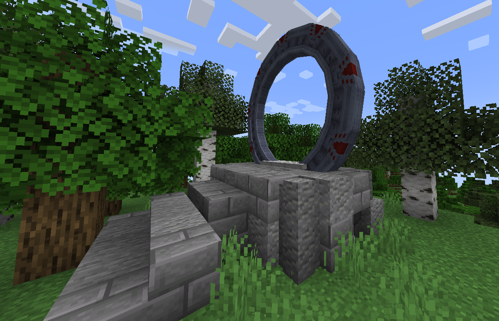
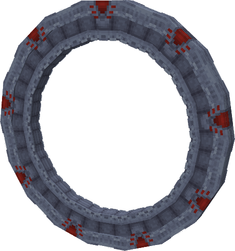
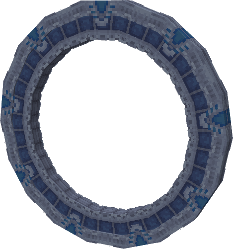
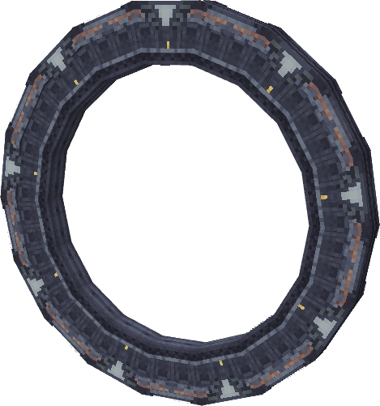
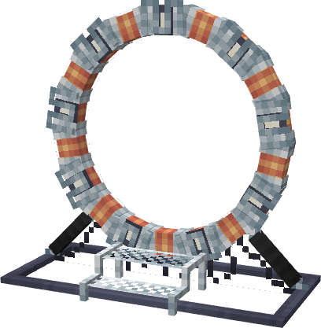
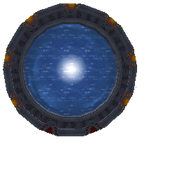
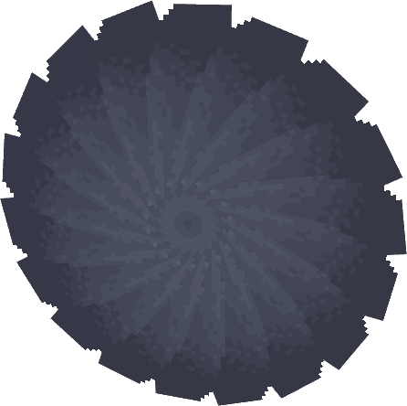

### This will tell you EVERYTHING a Stargate can do. Such as:

Here is a small guide for this page (there is quite a bit of information)

|- [Obtaining Gates](https://amblelabs.github.io/stargate-wiki/blocks/stargate/#obtaining-a-stargate)
|- [Gate Types](https://amblelabs.github.io/stargate-wiki/blocks/stargate/#gate-types)
|- [Gate Functions](https://amblelabs.github.io/stargate-wiki/blocks/stargate/#gate-mechanics)


## Obtaining a Stargate?

In this mod Stargates are found naturally. They can spawn in many biomes and dimensions, including:
>```
> Overworld: Desert, Forest
> Nether: Soul Sand Valley
> End: End Highlands
>```
----
There are 2 ways a stargate can spawn, on a plinth and burried

### Plinths:
----
Plinths spawn in all the biomes listed above and look like this (depending on the biome, the block pallet will change)!



### Burried Gates:
----
Burried Gates ONLY spawn in deserts and will be horizontal in the ground, requiring you to dig them out!

`INSERT IMAGE HERE!`

-----------

## Gate Types

In this mod there is 4 gate types `Milkyway`, `Pegasus`, `Universe`, and `Orlin`. Although they all have the same function, they are each very different.

### Milkyway



- This gate is the more know one. When dialing, Each `Chevron` will light up when you press a symbol on the dhd. However, if you use `insert mod or feature name here` the gates inner ring will spin till the selected symbol reaches the top `Chevron` Until it `dials` all symbols inputed on the [DHD](content/blocks/dhd.md).

### Pegasus

- This gate is all about LEDs, its inner ring doesnt spin at all. Instead each symbol will light up then spin (yes even with a [DHD](content/blocks/dhd.md)). Its `wormhole` is also a different color compaired to the `Milkyway` gate.

### Universe

- This being the first gate ever made, it is more "rustic". The whole gate spins for this type, it rotates until the symbol is at the top of the gate, then it glows. The `wormhole` is also completely differnt to the others. It being more "greyscale" than the others. It also has NO [DHD](content/blocks/dhd.md)!

### Orlin

- This is the smallest of all the gates and also has no [DHD](content/blocks/dhd.md). But is unique as it is build with blocks (not forgetting the toaster of course).


----


## Gate Mechanics

If you didnt know, gates are basically used as one way transportation but there is so much more behind them. 

### Basic Gate Functions

### Wormholes

- A wormhole is what you "travel" throught when entering an active stargate. In game it looks like **this** but will change color depending on the gate type. In survival if you; go into the reciving gates wormhole, OR walk into the kawoosh. YOU WILL DIE (if you are are in creative mod, you will be just fine. Also in creative you can go through both ways of an active stargate)




### Irises



- This is the ultimate defence agains unwanted guests coming through your stargate. Irises come in a range of different types, each type will last longer based on the tier that your gate has.

`THIS IS TEMP AND PROBS WILL CHANGE!`

>```
>Gold - Tier 0 (Breaks instantly, gives achievement "Did you really think that would work?")
>Copper - Tier 1 (25 durability, nearly destroyed by kawoosh, max temp 250°C)
>Iron - Tier 2 (50 durability, takes one quarter durability from kawoosh, max temp 300°C)
>Diamond - Tier 3 (150 durability, no kawoosh damage, max temp 700°C)
>Netherite - Tier 4 (250 durability, no kawoosh damage, max temp 800°C)
>Naquadah - Tier 5 (1000 durability, no kawoosh damage, max temp 1500°C)
>Energy Shield - Tier 6 (Consume power from an FE buffer if a mod with energy production is >installed, otherwise just has infinite durability)
>```

- 


